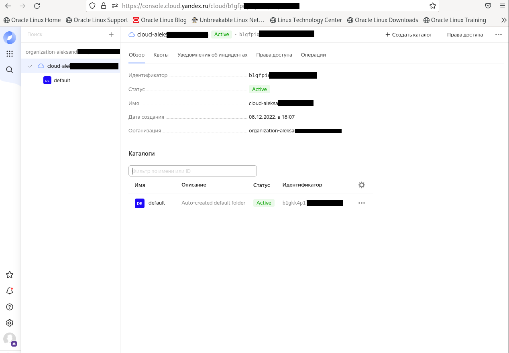
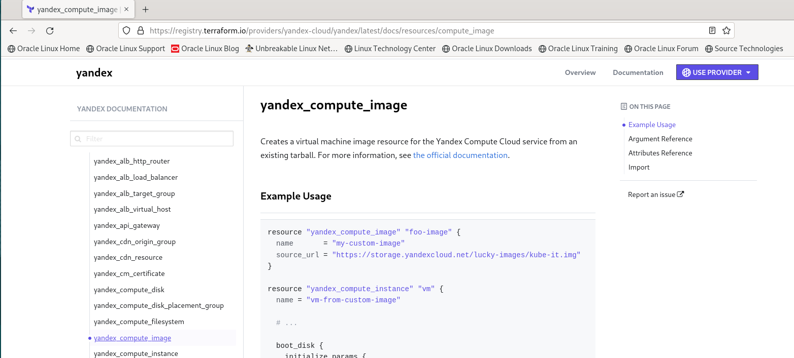

Зачастую разбираться в новых инструментах гораздо интересней понимая то, как они работают изнутри. 
Поэтому в рамках первого *необязательного* задания предлагается завести свою учетную запись в AWS (Amazon Web Services) или Yandex.Cloud.
Идеально будет познакомится с обоими облаками, потому что они отличаются. 

## Задача 1 (вариант с AWS). Регистрация в aws и знакомство с основами (необязательно, но крайне желательно).

Остальные задания можно будет выполнять и без этого аккаунта, но с ним можно будет увидеть полный цикл процессов. 

AWS предоставляет достаточно много бесплатных ресурсов в первый год после регистрации, подробно описано [здесь](https://aws.amazon.com/free/).
1. Создайте аккаут aws.
1. Установите c aws-cli https://aws.amazon.com/cli/.
1. Выполните первичную настройку aws-sli https://docs.aws.amazon.com/cli/latest/userguide/cli-configure-quickstart.html.
1. Создайте IAM политику для терраформа c правами
    * AmazonEC2FullAccess
    * AmazonS3FullAccess
    * AmazonDynamoDBFullAccess
    * AmazonRDSFullAccess
    * CloudWatchFullAccess
    * IAMFullAccess
1. Добавьте переменные окружения 
    ```
    export AWS_ACCESS_KEY_ID=(your access key id)
    export AWS_SECRET_ACCESS_KEY=(your secret access key)
    ```
1. Создайте, остановите и удалите ec2 инстанс (любой с пометкой `free tier`) через веб интерфейс. 

В виде результата задания приложите вывод команды `aws configure list`.

## Задача 1 (Вариант с Yandex.Cloud). Регистрация в ЯО и знакомство с основами (необязательно, но крайне желательно).

1. Подробная инструкция на русском языке содержится [здесь](https://cloud.yandex.ru/docs/solutions/infrastructure-management/terraform-quickstart).
2. Обратите внимание на период бесплатного использования после регистрации аккаунта. 
3. Используйте раздел "Подготовьте облако к работе" для регистрации аккаунта. Далее раздел "Настройте провайдер" для подготовки
базового терраформ конфига.
4. Воспользуйтесь [инструкцией](https://registry.terraform.io/providers/yandex-cloud/yandex/latest/docs) на сайте терраформа, что бы 
не указывать авторизационный токен в коде, а терраформ провайдер брал его из переменных окружений.

## Ответ  
Зарегался в облаке:  


```
yc config list

token: y0_AgAAAAACAaRvAA**
cloud-id: b1gfpiq**
folder-id: b1gp2l08pt**
compute-default-zone: ru-central1-a
```
Создаем сервисный аккаут https://cloud.yandex.ru/docs/iam/concepts/users/service-accounts :  
```
yc iam service-account create --name first-service-accaunt

id: ajec16jc9a27**
folder_id: b1gp2l08pt**
created_at: "2022-12-10T21:41:09.325987705Z"
name: first-service-accaunt
```

Узнать идентификатор сервисного аккаунта (столбец ID), которому нужно назначить роль можно вот так:
```
yc iam service-account list

+--------------------------------+----------------------------+
|          ID                    |         NAME               |
+--------------------------------+----------------------------+
| ajec16jc9a27**                 | first-service-accaunt      |
+--------------------------------+----------------------------+
```

Назначаем сервисному аккаунту роль на ресурс:  
```
yc resource-manager cloud add-access-binding b1gfpiqou** --role resource-manager.clouds.owner --subject serviceAccount:ajec16jc9a27**

done (2s)
```

Создаем ключ для сервисного аккаунта и пишем его файл:  
```
yc iam key create --service-account-id ajec16jc9a27** --folder-name netology --output key.json

id: aje7f2a8k8**
service_account_id: ajec16jc9a27**
created_at: "2022-12-10T22:10:18.883119782Z"
key_algorithm: RSA_2048
```

Создаем профиль CLI для выполнения операций от имени сервисного аккаунта. Указываем имя профиля:  
```
yc config profile create 'netology-tf-profile'

Profile 'netology-tf-profile' created and activated
```

Задаем конфигурацию профиля:  
```
yc config set service-account-key key.json
yc config set cloud-id  b1gfpiqoupeoqh6fjvi3
yc config set folder-id b1gp2l08pt4r645dl6gj
```

Добавляем аутентификационные данные в переменные окружения:  
```
export YC_TOKEN=$(yc iam create-token)
export YC_CLOUD_ID=$(yc config get cloud-id)
export YC_FOLDER_ID=$(yc config get folder-id)
```
Правим файл .terraformrc (если нет, то создаем):
```
[root@vmtester2 ~]# cat .terraformrc
provider_installation {
  network_mirror {
    url = "https://terraform-mirror.yandexcloud.net/"
    include = ["registry.terraform.io/*/*"]
  }
  direct {
    exclude = ["registry.terraform.io/*/*"]
  }
}
```

## Задача 2. Создание aws ec2 или yandex_compute_instance через терраформ. 

1. В каталоге `terraform` вашего основного репозитория, который был создан в начале курсе, создайте файл `main.tf` и `versions.tf`.
2. Зарегистрируйте провайдер 
   1. для [aws](https://registry.terraform.io/providers/hashicorp/aws/latest/docs). В файл `main.tf` добавьте
   блок `provider`, а в `versions.tf` блок `terraform` с вложенным блоком `required_providers`. Укажите любой выбранный вами регион 
   внутри блока `provider`.
   2. либо для [yandex.cloud](https://registry.terraform.io/providers/yandex-cloud/yandex/latest/docs). Подробную инструкцию можно найти 
   [здесь](https://cloud.yandex.ru/docs/solutions/infrastructure-management/terraform-quickstart).
3. Внимание! В гит репозиторий нельзя пушить ваши личные ключи доступа к аккаунту. Поэтому в предыдущем задании мы указывали
их в виде переменных окружения. 
4. В файле `main.tf` воспользуйтесь блоком `data "aws_ami` для поиска ami образа последнего Ubuntu.  
5. В файле `main.tf` создайте рессурс 
   1. либо [ec2 instance](https://registry.terraform.io/providers/hashicorp/aws/latest/docs/resources/instance).
   Постарайтесь указать как можно больше параметров для его определения. Минимальный набор параметров указан в первом блоке 
   `Example Usage`, но желательно, указать большее количество параметров.
   2. либо [yandex_compute_image](https://registry.terraform.io/providers/yandex-cloud/yandex/latest/docs/resources/compute_image).
6. Также в случае использования aws:
   1. Добавьте data-блоки `aws_caller_identity` и `aws_region`.
   2. В файл `outputs.tf` поместить блоки `output` с данными об используемых в данный момент: 
       * AWS account ID,
       * AWS user ID,
       * AWS регион, который используется в данный момент, 
       * Приватный IP ec2 инстансы,
       * Идентификатор подсети в которой создан инстанс.  
7. Если вы выполнили первый пункт, то добейтесь того, что бы команда `terraform plan` выполнялась без ошибок. 


В качестве результата задания предоставьте:
1. Ответ на вопрос: при помощи какого инструмента (из разобранных на прошлом занятии) можно создать свой образ ami?
2. Ссылку на репозиторий с исходной конфигурацией терраформа.  
 
 ## Ответ  
 1. С помощью Packer — инструмент для создания одинаковых образов ОС для различных платформ из одного описания.
 2. На основе сайта хашикорп:
 
 
 Создали файл main.tf с следующим содержимым:
```
provider "yandex" {
  token                    = "$YC_TOKEN"
  cloud_id                 = "$YC_CLOUD_ID"
  folder_id                = "$YC_FOLDER_ID"
  zone                     = "ru-central1-a"
}

resource "yandex_compute_image" "foo-image" {
  name       = "my-custom-image"
  source_url = "https://storage.yandexcloud.net/lucky-images/kube-it.img"
}

resource "yandex_compute_instance" "vm_default" {
  name        = "test_vm-from-custom-image"
  platform_id = "standard-v1"
  zone        = "ru-central1-a"

  resources {
    cores  = 1
    memory = 2
  }

  boot_disk {
    initialize_params {
      image_id = "image_id"
    }
  }

  network_interface {
    subnet_id = "${yandex_vpc_subnet.foo.id}"
  }

  metadata = {
    foo      = "bar"
    ssh-keys = "ubuntu:${file("~/.ssh/id_rsa.pub")}"
  }
}

resource "yandex_vpc_network" "foo" {}

resource "yandex_vpc_subnet" "foo" {
  zone           = "ru-central1-a"
  network_id     = "${yandex_vpc_network.foo.id}"
  v4_cidr_blocks = ["10.5.0.0/24"]
}
```

Также создали файл versions.tf:
```
terraform {
  required_providers {
    yandex = {
      source = "yandex-cloud/yandex"
    }
  }
  required_version = ">= 0.13"
}
```

Проверяем, что terraform plan выполняется без ошибок, но для начала проинициализируемся:
```
root@vmtester2 my_tf]# terraform init

Initializing the backend...

Initializing provider plugins...
- Finding latest version of yandex-cloud/yandex...
- Installing yandex-cloud/yandex v0.84.0...
- Installed yandex-cloud/yandex v0.84.0 (unauthenticated)

Terraform has created a lock file .terraform.lock.hcl to record the provider
selections it made above. Include this file in your version control repository
so that Terraform can guarantee to make the same selections by default when
you run "terraform init" in the future.

╷
│ Warning: Incomplete lock file information for providers
│
│ Due to your customized provider installation methods, Terraform was forced to calculate lock file checksums locally for the following providers:
│   - yandex-cloud/yandex
│
│ The current .terraform.lock.hcl file only includes checksums for linux_amd64, so Terraform running on another platform will fail to install these providers.
│
│ To calculate additional checksums for another platform, run:
│   terraform providers lock -platform=linux_amd64
│ (where linux_amd64 is the platform to generate)
╵

Terraform has been successfully initialized!

You may now begin working with Terraform. Try running "terraform plan" to see
any changes that are required for your infrastructure. All Terraform commands
should now work.

If you ever set or change modules or backend configuration for Terraform,
rerun this command to reinitialize your working directory. If you forget, other
commands will detect it and remind you to do so if necessary.
```
А теперь, собственно, наш безошибочный план:
```
[root@vmtester2 my_tf]# terraform plan

Terraform used the selected providers to generate the following execution plan. Resource actions are indicated with the following symbols:
  + create

Terraform will perform the following actions:

  # yandex_compute_image.foo-image will be created
  + resource "yandex_compute_image" "foo-image" {
      + created_at      = (known after apply)
      + folder_id       = (known after apply)
      + id              = (known after apply)
      + min_disk_size   = (known after apply)
      + name            = "my-custom-image"
      + os_type         = (known after apply)
      + pooled          = (known after apply)
      + product_ids     = (known after apply)
      + size            = (known after apply)
      + source_disk     = (known after apply)
      + source_family   = (known after apply)
      + source_image    = (known after apply)
      + source_snapshot = (known after apply)
      + source_url      = "https://storage.yandexcloud.net/lucky-images/kube-it.img"
      + status          = (known after apply)
    }

  # yandex_compute_instance.vm_default will be created
  + resource "yandex_compute_instance" "vm_default" {
      + created_at                = (known after apply)
      + folder_id                 = (known after apply)
      + fqdn                      = (known after apply)
      + hostname                  = (known after apply)
      + id                        = (known after apply)
      + metadata                  = {
          + "foo"      = "bar"
          + "ssh-keys" = <<-EOT
                ubuntu:ssh-rsa AAAAB3NzaC1yc2EAAAADAQABAAABgQCU+d4MEt8NXUlYSccP206bMl7bsAWM2lYLTr0PuUC5bjNn3BKCU3boc7WFyCY+3Ls4oYJCnkvmz/09bzRfGIhalZZuN+39f+WixzwVqyflj5yT1erSMXq1BcM7ahN4DnEM0/CczjhwnxPmEQuXNfhk9ChEE7dMC017CCbiQA0djYOd9H2vKB43Ll//Z88lmxk5/tUbJtbM**
            EOT
        }
      + name                      = "test_vm-from-custom-image"
      + network_acceleration_type = "standard"
      + platform_id               = "standard-v1"
      + service_account_id        = (known after apply)
      + status                    = (known after apply)
      + zone                      = "ru-central1-a"

      + boot_disk {
          + auto_delete = true
          + device_name = (known after apply)
          + disk_id     = (known after apply)
          + mode        = (known after apply)

          + initialize_params {
              + block_size  = (known after apply)
              + description = (known after apply)
              + image_id    = "image_id"
              + name        = (known after apply)
              + size        = (known after apply)
              + snapshot_id = (known after apply)
              + type        = "network-hdd"
            }
        }

      + metadata_options {
          + aws_v1_http_endpoint = (known after apply)
          + aws_v1_http_token    = (known after apply)
          + gce_http_endpoint    = (known after apply)
          + gce_http_token       = (known after apply)
        }

      + network_interface {
          + index              = (known after apply)
          + ip_address         = (known after apply)
          + ipv4               = true
          + ipv6               = (known after apply)
          + ipv6_address       = (known after apply)
          + mac_address        = (known after apply)
          + nat                = (known after apply)
          + nat_ip_address     = (known after apply)
          + nat_ip_version     = (known after apply)
          + security_group_ids = (known after apply)
          + subnet_id          = (known after apply)
        }

      + placement_policy {
          + host_affinity_rules = (known after apply)
          + placement_group_id  = (known after apply)
        }

      + resources {
          + core_fraction = 100
          + cores         = 1
          + memory        = 2
        }

      + scheduling_policy {
          + preemptible = (known after apply)
        }
    }

  # yandex_vpc_network.foo will be created
  + resource "yandex_vpc_network" "foo" {
      + created_at                = (known after apply)
      + default_security_group_id = (known after apply)
      + folder_id                 = (known after apply)
      + id                        = (known after apply)
      + labels                    = (known after apply)
      + name                      = (known after apply)
      + subnet_ids                = (known after apply)
    }

  # yandex_vpc_subnet.foo will be created
  + resource "yandex_vpc_subnet" "foo" {
      + created_at     = (known after apply)
      + folder_id      = (known after apply)
      + id             = (known after apply)
      + labels         = (known after apply)
      + name           = (known after apply)
      + network_id     = (known after apply)
      + v4_cidr_blocks = [
          + "10.5.0.0/24",
        ]
      + v6_cidr_blocks = (known after apply)
      + zone           = "ru-central1-a"
    }

Plan: 4 to add, 0 to change, 0 to destroy.

────────────────────────────────────────────────
Note: You didn't use the -out option to save this plan, so Terraform can't guarantee to take exactly these actions if you run "terraform apply" now.

```
